 

 

### About Me

I build production AI systems. Over the past two years I've shipped AI voice agents, RAG-backed knowledge assistants, and workflow automation engines that run live inside real businesses, alongside full-stack SaaS platforms that wrap those systems in usable products. My focus is turning LLMs and automation into systems that hold up under real traffic, real data, and real edge cases.

### What I Build

<table width="100%">
  <tr>
    <td width="33%" valign="top">
      <b>AI Automation Systems</b> 
      End-to-end automation pipelines that replace manual business operations with agent-driven workflows.
    </td>
    <td width="33%" valign="top">
      <b>AI Voice Agents</b> 
      Real-time conversational voice systems for support, sales, and scheduling use cases.
    </td>
    <td width="33%" valign="top">
      <b>Full-Stack SaaS Platforms</b> 
      Next.js + FastAPI/Node products with AI features baked into the core product experience.
    </td>
  </tr>
  <tr>
    <td width="33%" valign="top">
      <b>RAG & Knowledge Assistants</b> 
      Retrieval-augmented assistants grounded in private, domain-specific data via vector search.
    </td>
    <td width="33%" valign="top">
      <b>Workflow Automation</b> 
      n8n, webhooks, and custom backends stitched together to remove repetitive human steps.
    </td>
    <td width="33%" valign="top">
      <b>Scraping & Data Pipelines</b> 
      Resilient scraping and ETL pipelines that feed clean, structured data into downstream systems.
    </td>
  </tr>
  <tr>
    <td width="33%" valign="top">
      <b>API Integrations</b> 
      Connecting disparate SaaS tools, CRMs, and internal systems into one coherent data flow.
    </td>
    <td width="33%" valign="top"></td>
    <td width="33%" valign="top"></td>
  </tr>
</table>

### Tech Stack

<table width="100%">
<tr><td>

**Languages**
 

&nbsp;

</td></tr>
<tr><td>

**Frontend**
 

</td></tr>
<tr><td>

**Backend**
 

&nbsp;

&nbsp;

</td></tr>
<tr><td>

**AI / LLM**
 

 

</td></tr>
<tr><td>

**Databases**
 

&nbsp;

</td></tr>
<tr><td>

**Automation**
 

 

</td></tr>
<tr><td>

**DevOps / Tools**
 

&nbsp;

</td></tr>
</table>

### Featured Systems

Most of my client work is under NDA and lives in private repos — these are the systems I can show publicly.
  

<table width="100%">
<tr><td>

**AI Voice Agent — HVAC**

A voice-agent product for the HVAC industry, built as two connected pieces:

- **Landing page** — public demo where visitors can call in and talk to the agent live
- **Dashboard** — internal panel for monitoring calls, reviewing transcripts, and configuring the agent

**Stack:** Next.js · Tailwind · Python · FastAPI · OpenAI/Claude · Telephony API · Supabase

**Problem solved:** Gives an HVAC business a phone-answering agent prospects can test themselves, plus a dashboard to monitor and manage it.

[Try the Live Demo →](https://hvac-landing-page-eight.vercel.app/)

</td></tr>
<tr><td>

**AI Newsletter App**

<!-- REPLACE: tighten this description to exactly what the app does (content generation, curation, sending, etc.) -->
An AI-powered app that automates the content behind a regular newsletter, cutting down the manual research and writing work.

**Stack:** Next.js · OpenAI/Claude · <!-- REPLACE: confirm backend/DB used -->

**Problem solved:** Removes the manual effort of researching and drafting newsletter content on a recurring schedule.

[View Project →](https://github.com/Mehroz27/AI-Newsletter)

</td></tr>
</table>

### Activity

<!-- Contribution snake — populated after first Actions run; see .github/workflows/profile.yml -->

### Current Focus

- Designing agentic AI systems that operate reliably in production, not just demos
- Voice AI for real-time, low-latency conversational use cases
- Business process automation that removes manual operational overhead
- Full-stack AI products where the model is part of the core workflow, not a feature bolt-on
- Developer workflow tooling that speeds up how AI systems get built and shipped

### Contact

Open to collaborating on AI agent systems, voice AI, and automation-heavy products.

